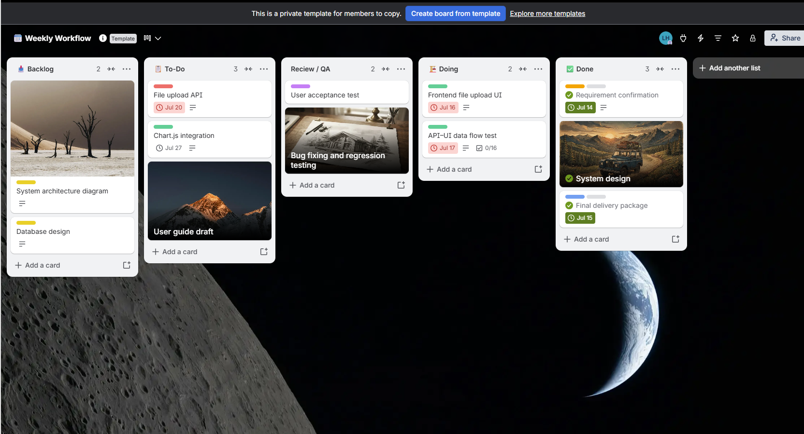
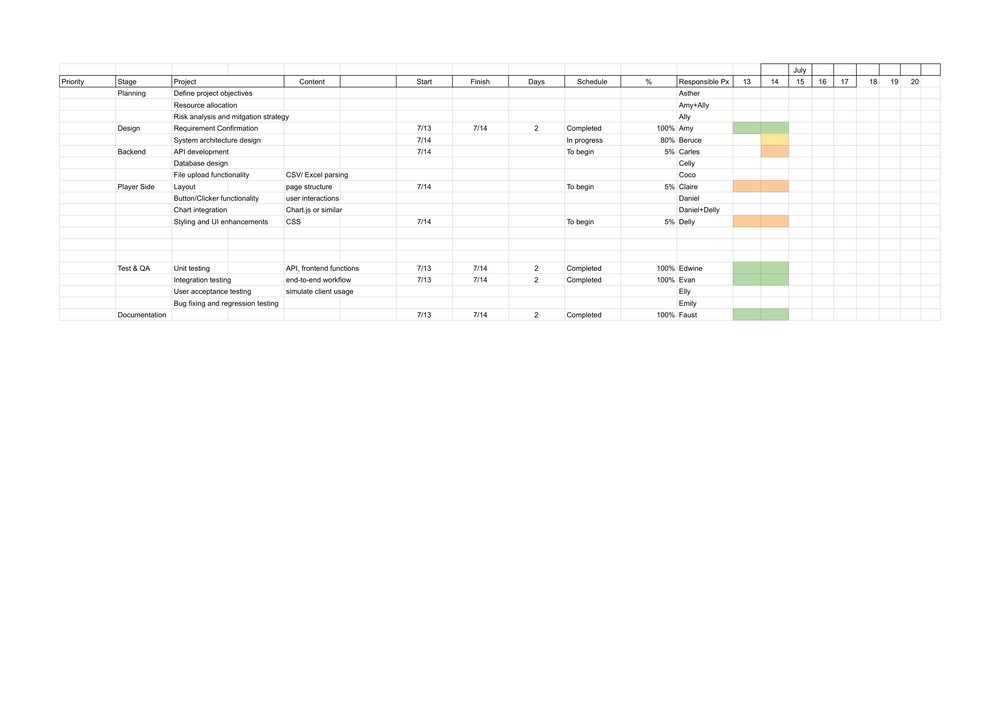

# ERP Dashboard Project Management Portfolio

This repository showcases the ERP Dashboard project managed and coordinated by Lirong.  It includes project management documents, Gantt chart, user guide, and backend source files.

---

## Project Files

| File | Description |
|------|--------------|
| `index.js` | Frontend entry point for ERP dashboard |
| `server.js` | Backend server logic |
| `Grantt_for_ERP-1.png` | Project timeline and task schedule |
| `User_Guide_forERP.png` | User manual for ERP dashboard features |

---

## Project Management Overview

###  Trello Board (For Engineers)  
>  Used to track technical tasks, progress, and collaboration.

 [View Trello Board (Live)](https://trello.com/invite/b/6a56f5d03ec78862594e025d/ATTIfde492f2c1d0caa745c47d3dc8df73fbD2982C47/🗓️-weekly-workflow)  

###  Gantt Chart (For Boss / Management)
> Provides a clear overview of the project timeline, milestones, and progress planning.

 

###  User Guide  (For Clients)
> Explains system usage and ensures customers can successfully operate the ERP Dashboard.
- [User Guide (PDF)](User_Guide_forERP.pdf)
  

---

## Trello Labels
- 🔴 Backend / API Development  
- 🟡 System Design / Architecture  
- 🟢 Frontend UI / Integration  
- 🔵 Documentation / User Guide  
- 🟣 Testing / QA  
- 🟠 Management / PM chores  
- ⚪ Completed / Done  

---

## Reflection
This project demonstrates:
- Clear task tracking via Trello board  
- Structured timeline using Gantt chart  
- Integration of technical and PM documentation  
- Delivery of a complete ERP dashboard with user guide

---

## Tech Stack
- Node.js  
- Express.js  
- Chart.js  
- CSV/Excel file parsing  

---

##  Author
**Lirong📌**  
Project Management Trainee | Scrum Certified (PSM I)  
Taipei, Taiwan
